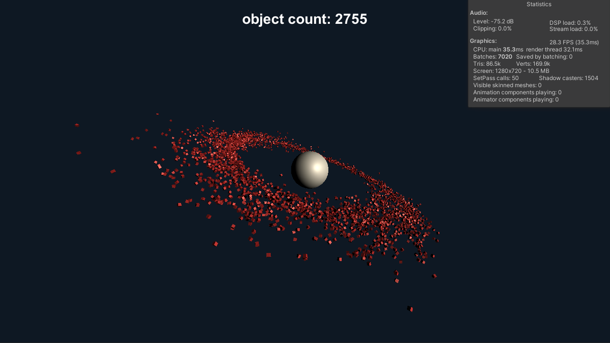

# unity-optimization-challenge

## The challenge is simple. Boost performance.

This sample contains, probably, the worst implementation for this scenario. How much can you improve?

### How to use:

- Open Sample Scene
- Play

### Keyboard Input:
- Space - Spawn cubes
- Up arrow - Multiply Gravity by 5
- Down arrow - Divide Gravity by 5
- Backspace - Invert Gravity while pressing
- 1 to 4 - Change time scale

### Notes

Created with unity version 2020.2

The force of the planet does not take mass into account, just distance.